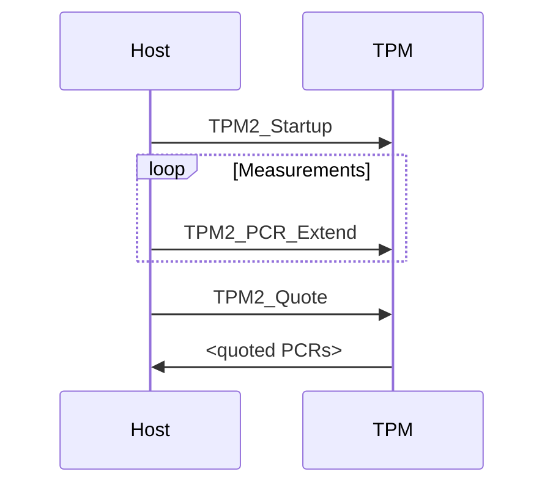

⚠️ This repository contains **prototype** PDF templating tools for easily using Markdown as source-of-truth for TCG docs. They are currently **experimental** and not official, final, nor approved.

# How to use this for your document (GitHub)

Write normal Markdown, with a YAML front matter with the relevant metadata. See the [sample](sample) directory for some examples.

TCG makes use of a gray box for "informative text." To write informative text in your Markdown source, use the block-quote syntax:

```md
> Informative text goes here!
>
> It can be multiple paragraphs, if you wish.
```

You can include diagrams using [Mermaid](https://mermaid-js.github.io/mermaid/#/) syntax:

````md

````

The code above generates a diagram that looks like this:


If a list of figures is included (`lof: true` in the YAML preamble) then there will be a link to a figure called "Sequence Diagram A".

You can also include images. Note: GitHub and Pandoc disagree somewhat on the paths to images,
so the safest path to success is to keep the Markdown source and image files all
together in the **root** of the repository.

```md

```

produces:


If a list of figures is included (`lof: true` in the YAML preamble) then there will be a link to a figure called "Image B".


Here is an example of a GitHub Action configuration that renders a Markdown file to PDF, attaches it to the workflow, and checks it into the repo (if not a pull request):

```yaml
name: Render

on:
  push:
    branches:
      - main
  pull_request:
  workflow_dispatch:

jobs:
  render:
    runs-on: ubuntu-latest
    container:
      image: ghcr.io/trustedcomputinggroup/pandoc:latest
    permissions:
      contents: read
    name: Render the example text
    steps:
      - name: Checkout
        uses: actions/checkout@v3

      - name: Render
        uses: trustedcomputinggroup/markdown@latest
        with:
          input-md: lorem.md
          output-pdf: lorem.pdf

      - name: Upload Artifact
        uses: actions/upload-artifact@master
        with:
          name: lorem.pdf
          path: lorem.pdf
          
      - name: Check in latest render
        uses: stefanzweifel/git-auto-commit-action@v4
        with:
          commit_message: Generate latest PDF
          file_pattern: lorem.pdf
        if: github.event_name != 'pull_request'
```

# How to use this for your document (Local)

Either clone the repository and install [Pandoc](https://pandoc.org) and its dependencies, or

```sh
docker pull ghcr.io/trustedcomputinggroup/markdown:latest
```

When running Pandoc (either directly or using `docker run`), you'll have to pass all the arguments that [the action](action.yml) does.

# How to contribute to this template

Send a PR! A GitHub Action in this repo will automatically run the tools with all your changes on top. You can find the rendered samples under "action validation" in the "checks" tab of your PR:

