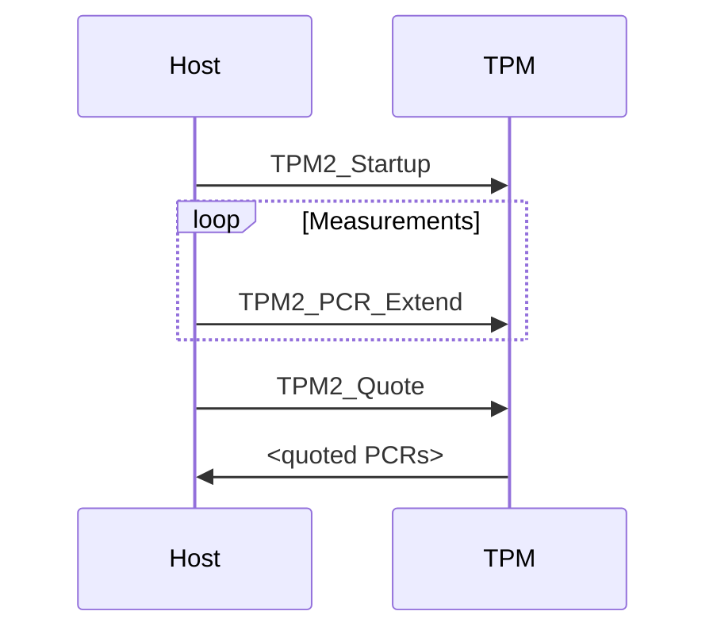

⚠️ This repository contains **prototype** PDF templating tools for easily using Markdown as source-of-truth for TCG docs. They are currently **experimental** and not official, final, nor approved.

# How to use this for your document (GitHub)

Create a private repository based on the
[example template repository](https://github.com/TrustedComputingGroup/specification-example),
or set up the GitHub action in any repository using the [instructions below](#setting-up-the-github-action).

## Document metadata

Write normal Markdown, with a YAML document metadata block at the top, containing the relevant metadata.

````
---
title: "Document Title"
version: 0.1
revision: 1
date: 2022/09/17
type: SPECIFICATION
status: DRAFT
...
````

`status` can be any string, but if it is `DRAFT` then the tool will render a watermark on the PDF.

```
status: DRAFT
```

You can specify either the `bluetop` or `greentop` (default) cover backgrounds with the following optional YAML metadata field:

```
template: bluetop
```

or 

```
template: greentop
```

## Separators and page breaks

Horizontal separators are transformed by the workflow into page breaks for readability in both GitHub and PDF views.

```
---
```

## Tables of contents, figures, and tables

Provide a table of contents, list of figures, and list of tables anywhere
(usually, after the disclaimers, change history, and document-style remarks)
in the document with:

```
---

\tableofcontents

\listoffigures

\listoftables

---
```

## Tables

Tables in Markdown look like the following:

```
| **Revision** | **Date**   | **Description** |
| ------------ | ---------- | --------------- |
| 0.1/1        | 2022/09/17 | Initial draft   |
```

| **Revision** | **Date**   | **Description** |
| ------------ | ---------- | --------------- |
| 0.1/1        | 2022/09/17 | Initial draft   |

## Informative text blocks

TCG makes use of a gray box for "informative text." To write informative text in your Markdown source, use the block-quote syntax:

```md
> Informative text goes here!
>
> It can be multiple paragraphs, if you wish.
```

It will look like this in the GitHub markdown view:

> Informative text goes here!
>
> It can be multiple paragraphs, if you wish.

The tool will insert the "Start of informative text" / "End of informative text" delimiters
into the informative text blocks automatically.

## Diagrams

You can include diagrams using [Mermaid](https://mermaid-js.github.io/mermaid/#/) syntax:

````md

````

The code above generates a diagram that looks like this:


In the example above, "Sequence Diagram A" is the name shown in the figure caption and table of figures.
To exclude the caption and table-of-figures entry, leave out the caption on the first line, i.e. just:
````
```mermaid
````

Mermaid supports the following types of diagrams:

* Sequence diagrams (as above)
* Flow charts
* Gantt charts
* UML class diagrams
* Git branch graphs
* And [more](https://mermaid-js.github.io/mermaid/#/)

## Images

You can also include images if you check them into the root of the repository.
Note: GitHub and Pandoc disagree somewhat on the paths to images,
so the safest path to success is to keep the Markdown source and image files
all together in the **root** of the repository.

```md

```

produces:


In the example above, "Image B" is the name shown in the figure caption and table of figures.
To exclude the caption and table-of-figures entry, leave the caption blank (i.e., ``)

See the samples in the root directory for more examples.

Here is an example of a GitHub Action configuration that renders a Markdown file to PDF, attaches it to the workflow, and checks it into the repo (if not a pull request):

# Setting up the GitHub action

```yaml
name: Render

on:
  push:
    branches:
      - main
  pull_request:
  workflow_dispatch:

jobs:
  render:
    runs-on: ubuntu-latest
    container:
      image: ghcr.io/trustedcomputinggroup/pandoc:0.3.0
    name: Render PDF
    steps:
      - name: Checkout
        uses: actions/checkout@v3

      - name: Render
        uses: trustedcomputinggroup/markdown@v0.2.5
        with:
          input-md: main.md
          output-pdf: spec.pdf

      - name: Upload samples
        uses: actions/upload-artifact@master
        with:
          name: spec.pdf
          path: spec.pdf

      - name: Check in latest render
        uses: stefanzweifel/git-auto-commit-action@v4
        with:
          commit_message: Generate latest PDF
          file_pattern: spec.pdf
        if: github.event_name != 'pull_request'
```

# How to use this for your document (Local)

Either clone the repository and install [Pandoc](https://pandoc.org) and its dependencies, or

```sh
docker pull ghcr.io/trustedcomputinggroup/markdown:latest
```

When running Pandoc (either directly or using `docker run`), you'll have to pass all the arguments that [the action](action.yml) does.

# How to contribute to this template

Send a PR! A GitHub Action in this repo will automatically run the tools with all your changes on top. You can find the rendered samples under "action validation" in the "checks" tab of your PR:

